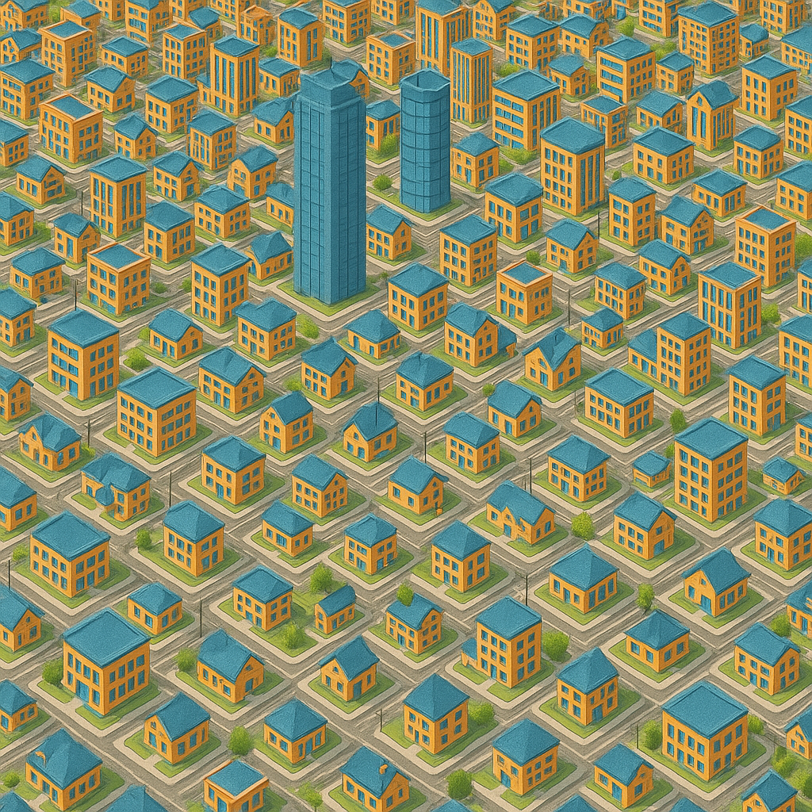

<div align="center">
  <h1>Building2Building</h1>
  
  <p><strong>Benchmarking transfer learning in Reinforcement Learning on millions of buildings.</strong></p>
</div>


## Installation Steps

To install from a local checkout, do

``` shell
pip install -e .
```

### EnergyPlus path

This library uses energyplus's simulator through its python API. In a standard
system, the appropriate binary distribution of energyplus should be
automatically downloaded and used, but if that is not appropriate for your
system and you want to use a custom energyplus installation, set the
`ENERGYPLUS_PATH` environment variable to point to the root of your energyplus
installation directory, which should look like this:

```
$ ls
bin
Bugreprt.txt
ConvertInputFormat
ConvertInputFormat-25.1.0
DataSets
Deprecation.html
Documentation
Energy+.idd
energyplus
energyplus.1
energyplus-25.1.0
Energy+.schema.epJSON
EPLaunch
EPMacro
etc
ExampleFiles
ExpandObjects
favicon.png
include
lib
libenergyplusapi.so
libenergyplusapi.so.25.1.0
libpython3.12.so.1.0
LICENSE.txt
MacroDataSets
manifest
PostProcess
PreProcess
pyenergyplus
python_lib
PythonLicense.txt
readme.html
runenergyplus
runepmacro
runreadvars
SetupOutputVariables.csv
share
VersionUpdater
WeatherData
workflows
```

## Workflow

### Searching the IDF files and weather files databases

In the `building2building.sources.*` family, there are a couple of submodules
containing procedures that expose to you energyplus resources (weather files and
idf files) from different datasets. Before being ready to use, however, many of
these files need to go through a relatively complex pipeline that upgrades them
to the latest energyplus version, adds relevant meters and more. The procedures
in each source submodule arrange for the pipeline to be run correctly on files
that you end up using for simulation. For caching purposes, many of these
procedures will return "Derivations" that you can then `realize` to obtain the
actual file.

``` python
from building2building.env import STORE_PATH
from building2building.sources.energycodes import search_buildings
from building2building.store import realize

small_offices = search_buildings(building_type="SmallOffice")

file = realize(STORE_PATH.get(), small_offices.iloc[0].derivation_thunk())
```

### Creating gym environments

In the `building2building.sources.*` familty of submodules, there will also be
functions to compose together building files, weather files reward configs and
other parameters into a `BuildingConfig` that is used to create a gymnasium
environment using `building2building.simulator.create_simulator`.

## Minergym

The gym wrapper of energyplus is based on the minergym repository https://github.com/Terramorpha/minergym

## OfflineRL-Kit

The implementation of the off line RL algorithms is taken from https://github.com/yihaosun1124/OfflineRL-Kit/tree/main

