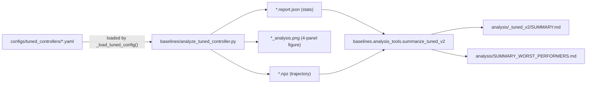

# Tuned-Controller Analysis

Full-year diagnostic rollouts for the controllers produced by
[Controller Tuning](tuning.md). The pipeline generates one trajectory,
one time-series figure, and one JSON report per building, then aggregates
them into per-type summaries and a global worst-performer report.

This is the pipeline used to produce the `analysis/*_tuned_v2/` artefacts
shipped with the repo.

## Pipeline



Each step is idempotent: re-running a rollout overwrites its three
artefacts without touching the others, and `summarize_tuned_v2` only reads
the per-building files.

## 1. Per-building rollout

`baselines/analyze_tuned_controller.py` runs one full-year episode for a
specified `(building_type, building_id, climate_zone, task)` with the
matching tuned controller config. It auto-selects `UnitaryHvacPolicy` or
`AirLoopPolicy` based on `VAV_BUILDING_TYPES = {"OfficeMedium"}`.

### Single-building usage

```bash
python -m baselines.analyze_tuned_controller \
    --building-type OfficeMedium \
    --building-id OfficeMedium-4949 \
    --climate-zone 1 \
    --task task1 \
    --output-dir analysis/officemedium_tuned_v2
```

Writes three files under `--output-dir`:

| File | Contents |
|---|---|
| `OfficeMedium-4949_cz1.npz` | Per-step `zone_temperatures`, `setpoints`, `outdoor_temperature`, `energy_{electricity,gas}`, `actions`, `rewards`, `temp_term`, `energy_term`, and a JSON-encoded `meta` string with zone / action / controlled-zone names |
| `OfficeMedium-4949_cz1_analysis.png` | 4-panel figure: zone T vs setpoints, deviation with ±1 °C deadband shading, outdoor T with HVAC energy, and reward decomposition |
| `OfficeMedium-4949_cz1.report.json` | Per-zone and aggregate deviation statistics, actuator saturation stats, and reward decomposition (`mean_per_step`, `temp_term_mean`, `energy_term_mean`) |

### Auto-selecting test-split buildings

Omitting `--building-id` and passing `--n-buildings N` analyzes the first
`N` test-split buildings matching `(type, cz)`:

```bash
python -m baselines.analyze_tuned_controller \
    --building-type OfficeSmall \
    --climate-zone 3 \
    --n-buildings 3 \
    --task task1 \
    --output-dir analysis/officesmall_tuned_v2
```

Building selection is deterministic — it uses
`b2b.list_buildings_by_climate_zone(..., split="test")` for typed CZs and
`b2b.list_buildings(..., split="test")` for `SingleFamilyHouse`
(`TYPES_WITHOUT_CLIMATE_ZONE`).

### All flags

| Flag | Type | Default | Description |
|---|---|---|---|
| `--building-type` | str | — | Required. e.g. `OfficeMedium`. |
| `--building-id` | str | `None` | Explicit ID; omit together with `--n-buildings`. |
| `--climate-zone` | int | — | Required. Use `0` for `SingleFamilyHouse`. |
| `--n-buildings` | int | `1` | Only used when `--building-id` is absent. |
| `--task` | str | `task1` | Task preset name. |
| `--run-period` | str | `full_year` | One of `full_year`, `winter`, `summer`. |
| `--output-dir` | path | — | Required. Parent directory; created on demand. |
| `--deadband-c` | float | `1.0` | Half-width for `frac_in_deadband`. |

### Trajectory `.npz` schema

Loaded back with `np.load`:

```python
import json
import numpy as np

d = np.load("analysis/officesmall_tuned_v2/OfficeSmall-5041_cz4.npz")
meta = json.loads(str(d["meta"]))
# meta = {
#   "building_type", "building_id", "climate_zone", "task",
#   "zone_names": [...],          # length n_zones
#   "controlled_zones": [...],    # subset of zone_names
#   "action_names": [...],        # length n_act
# }

zone_t  = d["zone_temperatures"]   # (T, n_zones)    T = episode_length + 1
sp      = d["setpoints"]           # (T, n_zones)
out_t   = d["outdoor_temperature"] # (T,)
elec    = d["energy_electricity"]  # (T,)
gas     = d["energy_gas"]          # (T,)
actions = d["actions"]             # (T-1, n_act)
rew     = d["rewards"]             # (T-1,)
temp_t  = d["temp_term"]           # (T-1,) MSE(T − target) over controlled zones
ener_t  = d["energy_term"]         # (T-1,) elec + gas
```

Setpoint reconstruction: in `constant` target-temperature mode (the default
for `task1..4`) the simulator does not emit `target_temperature <zone>`
observations. The script falls back to
`env.metadata["task_config"].target_for_zone(zone).occupied_c` so
`setpoints` is always populated for controlled zones.

### Report schema

`OfficeSmall-5041_cz4.report.json` contains:

```json
{
  "building_type": "OfficeSmall",
  "building_id": "OfficeSmall-5041",
  "climate_zone": 4,
  "task": "task1",
  "episode_length": 105120,
  "temperatures": {
    "per_zone":  [{"zone": "...", "mean_dev_c": ..., "pct_{1,5,...,99}": ...,
                    "frac_in_deadband": ..., "max_over_c": ..., "max_under_c": ...}, ...],
    "aggregate": { ... same keys, across all controlled zones ... }
  },
  "actions": {
    "n_actuators": 2,
    "mean":        [..., ...],
    "frac_at_min": [..., ...],
    "frac_at_max": [..., ...]
  },
  "reward": {
    "total":              ...,
    "mean_per_step":      ...,
    "temp_term_mean":     ...,
    "energy_term_mean":   ...
  }
}
```

## 2. SLURM array launcher (25 × 3 buildings)

`baselines/scripts/analyze_tuned_controllers.sh` fans out 25 array tasks,
each processing `N_BUILDINGS=3` test-split buildings for one `(type, cz)`
pair — the exact configuration used to produce the v2 artefacts:

```bash
sbatch baselines/scripts/analyze_tuned_controllers.sh
```

Defaults:

- `--array=0-24` — one task per `(type, cz)` pair.
- `--time=04:00:00` — each full-year rollout is ~4-5 min; 3 rollouts per
  task ≈ 15 min; 4 h of walltime is ample headroom.
- `--mem=16G`, `--cpus-per-task=2` — fits a single EnergyPlus process plus
  the numpy post-processing.
- `N_BUILDINGS=3` — override at submit time with `N_BUILDINGS=5 sbatch ...`
  to evaluate more test buildings per pair.

Output layout after the array completes:

```
analysis/
├── singlefamilyhouse_tuned_v2/    (3 npz/png/json for SFH-{0011,0014,0015})
├── restaurantfastfood_tuned_v2/   (24 × 3 files for RFF cz1..8)
├── officemedium_tuned_v2/         (24 × 3 files for OffM cz1..8)
└── officesmall_tuned_v2/          (24 × 3 files for OffS cz1..8)
```

### Running a single `(type, cz)` outside SLURM

The launcher is mostly a shell loop around
`baselines.analyze_tuned_controller`; to reproduce one cell locally:

```bash
python -m baselines.analyze_tuned_controller \
    --building-type RestaurantFastFood --climate-zone 4 \
    --n-buildings 3 --task task1 \
    --output-dir analysis/restaurantfastfood_tuned_v2
```

## 3. Aggregation

After the per-building rollouts complete, run:

```bash
python -m baselines.analysis_tools.summarize_tuned_v2
```

This reads every `*.report.json` under the four `TYPE_DIRS` in
`baselines/analysis_tools/summarize_tuned_v2.py`, and writes:

| Output | Contents |
|---|---|
| `analysis/<type>_tuned_v2/SUMMARY.md` | Per-CZ and overall **mean / p50 / p95** for reward/step, comfort violation (`1 − frac_in_deadband`), and annual HVAC energy (Wh/m²). Plus top-3 best and bottom-3 worst buildings by reward. |
| `analysis/SUMMARY_WORST_PERFORMERS.md` | Global top-5 worst buildings across all types, with a diagnostic verdict (see below). |

### Worst-performer diagnosis

The summarizer loads the matching `.npz` trajectory for each of the 5
worst buildings and classifies the failure mode:

- **`hvac_limited`** — actuator saturation on max-demand steps coincides
  with a large `|T − setpoint|`. The HVAC system is at its capacity limit,
  so the controller cannot do better regardless of tuning. The diagnosis
  is sharpened with directional bias (e.g. "undersized cooling — zone
  overheats" vs "undersized heating — zone undercools") based on the sign
  of the deviation when actuators are pinned.
- **`control_failure`** — comfort violations occur while actuators are
  *not* saturated. Indicates the controller policy itself is the
  bottleneck (e.g. bang-bang oscillation or wrong gain).

Heuristic thresholds live at the top of `summarize_tuned_v2.py`:

```python
SATURATION_FRAC_THRESHOLD: float = 0.50
COMFORT_VIOLATION_FRAC_THRESHOLD: float = 0.05
WARMUP_FRAC: float = 0.10
```

`WARMUP_FRAC` drops the first 10 % of the trajectory from the
saturation/deviation statistics to avoid misattributing startup transients.

## 4. Reproducing the v2 analysis end-to-end

Assuming the tuned YAMLs from [Controller Tuning](tuning.md) are already
present under `baselines/configs/tuned_controllers/`:

```bash
# 1. Fan out 25 full-year rollouts × 3 buildings each on SLURM
sbatch baselines/scripts/analyze_tuned_controllers.sh

# 2. (After the array finishes) aggregate into per-type + global reports
python -m baselines.analysis_tools.summarize_tuned_v2
```

Or, on a single machine without SLURM (each `(type, cz)` pair takes ~15 min
serial):

```bash
for IDX in $(seq 0 24); do
    SLURM_ARRAY_TASK_ID=$IDX bash baselines/scripts/analyze_tuned_controllers.sh
done
python -m baselines.analysis_tools.summarize_tuned_v2
```

## Why the tuned gain can misgeneralize

`SingleFamilyHouse-0014` is the only SFH in the test split that exhibits a
pronounced ~1.5-2 h limit cycle in the zone temperature (see its
`_analysis.png`). The failure mode is instructive:

- The two well-behaved SFHs (0011, 0015) share the **same tuned config**
  with 0014, but have 2–2.5× more conditioned area and a ~2× smaller
  heat-pump fan. Their **fan / m²** ratios are 0.0013–0.0015 kg·s⁻¹·m⁻²
  versus **0.0061** for 0014.
- The tuned `sat_respond = 4.35 °C/step` slams the commanded thermostat
  setpoint by ~4.35 °C every 5-min step outside the deadband. On a
  low-thermal-mass / oversized-HP combination like 0014, that produces a
  stable bang-bang limit cycle; on a more typical SFH it's just slightly
  aggressive.
- Reducing `sat_respond` to `1.0` takes 0014 from **43 %** in-deadband to
  **89 %** with a 5× better reward/step, but costs 0011/0015 a few
  points — there is no single `sat_respond` that is optimal across the
  three buildings.

Diagnosis script (re-runs the same YAML with an overridden `sat_respond`):
`analysis/_sfh_0014_sweep/run_sweep.py`. This is a **control-failure**
case that the tuner missed because the reward does not penalize action
variance and the training split did not contain a small-area /
large-HP outlier. Mitigations are listed at the bottom of
`analysis/SUMMARY_WORST_PERFORMERS.md`.

## Caveats

- The SLURM launcher currently does not cover `Warehouse` or
  `RetailStandalone`, even though tuned configs exist for all 8 climate
  zones of each. Extend `CONFIGS=(...)` in
  `baselines/scripts/analyze_tuned_controllers.sh` and bump `--array` to
  add them (e.g. `--array=0-40` for `4 + 2` × 8 pairs).
- `deadband_c=1.0` is baked into both the per-building figures and the
  aggregation thresholds. Changing it requires re-running both stages.
- The `constant`-target fallback in `_setpoint_indices` uses
  `task_config.target_for_zone(...).occupied_c`; tasks with an occupancy
  schedule (`target_temperature_mode="occupancy"`) emit the target in the
  observation vector directly, so no fallback is needed.

## Related pages

- [Controller Tuning](tuning.md) — upstream Optuna tuning that produces
  the YAMLs this analysis consumes.
- [Reactive Controllers](controllers.md) — description of
  `UnitaryHvacPolicy` and `AirLoopPolicy`, including the parameters
  referenced in the diagnosis above.
- [Known Issues](../about/known-issues.md) — ongoing limitations of the
  tuner and controller families.
