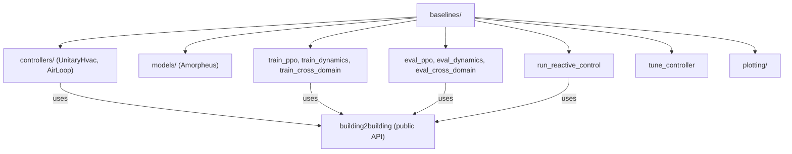

# Baselines Overview

## Architecture

The `baselines/` directory contains reference implementations of the control
baselines and transfer experiments from the Building2Building paper. It is
**separate from the `building2building` package** and uses only the public API.



## Directory Structure

```
baselines/
├── controllers/           # Reactive controllers
│   ├── unitary_hvac.py    # PI + Trim-and-Respond for unitary systems
│   └── air_loop.py        # VAV air-loop controller
├── models/
│   └── amorpheus.py       # Type-heterogeneous transformer (Section 6.2)
├── utils/
│   ├── training.py        # SB3 PPO builder, vectorized envs
│   ├── evaluation.py      # Episode rollout functions
│   ├── metadata.py        # Observation/action name helpers
│   └── callbacks.py       # W&B training callbacks
├── plotting/              # Matplotlib figure scripts
├── configs/               # Hydra configuration
├── run_reactive_control.py      # Baseline CSV generation
├── train_ppo.py           # Per-building PPO specialist (Section 5)
├── train_dynamics_adaptation.py  # Section 6.1
├── train_cross_domain.py  # Section 6.2 (Amorpheus)
├── eval_*.py              # Evaluation scripts
├── tune_controller.py     # Optuna-based controller tuning
└── requirements.txt
```

## Installation

```bash
pip install -e ".[training]"   # Installs all required dependencies
```

## Quick Start

```bash
# 1. Generate baseline returns CSV (needed for scoring)
python -m baselines.run_reactive_control experiment=eval_reactive_control \
    building_types=[OfficeSmall] tasks=[task1] max_buildings_per_type=5

# 2. Train per-building PPO specialists
python -m baselines.train_ppo experiment=train_ppo \
    building_types=[OfficeSmall] tasks=[task1] buildings_per_type=1

# 3. Train dynamics adaptation with building parameters
python -m baselines.train_dynamics_adaptation \
    experiment=train_dynamics_parameterized difficulty=easy
```

## Configuration

All scripts use [Hydra](https://hydra.cc/) for configuration. Every script
follows the pattern:

```bash
python -m baselines.<script> experiment=<name> [overrides...]
```

See [Configuration (Hydra)](../guide/configuration.md) for the full config
reference.

## Components

| Page | Description |
|---|---|
| [Reactive Controllers](controllers.md) | UnitaryHvac and AirLoop controllers |
| [PPO Specialist](ppo-specialist.md) | Per-building PPO training (Section 5) |
| [Dynamics Adaptation](dynamics-adaptation.md) | Multi-building training (Section 6.1) |
| [Cross-Domain Transfer](cross-domain.md) | Amorpheus transformer (Section 6.2) |
| [Controller Tuning](tuning.md) | Optuna hyperparameter optimization |
| [Tuned-Controller Analysis](analysis.md) | Full-year rollouts, per-building figures, and per-type summaries for the tuned controllers |
| [Plotting](plotting.md) | Paper figure generation |
