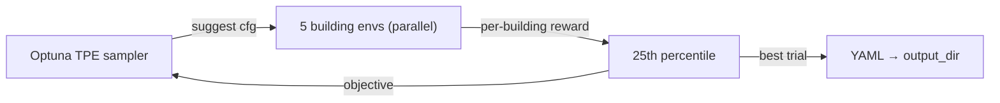

# Controller Tuning

Tune reactive controller parameters (`UnitaryHvacConfig` or `AirLoopConfig`)
per `(building_type, climate_zone)` pair with Optuna. The tuned YAMLs land
under the run's `output_dir`; the ones committed in
`baselines/configs/tuned_controllers/` are the controllers consumed by
`baselines/run_reactive_control.py` at rollout time.

## Overview

`baselines/tune_controller.py` runs an Optuna TPE study per `(type, cz)`.
Each trial samples the controller hyperparameters, evaluates the policy on
`n_eval_buildings` test-split buildings in parallel, and reports the
25th-percentile episode return as the objective (robust to a single unlucky
building — see `aggregation` below).

Studies are persisted to a SQLite database so jobs can be **resumed** after
an OOM or walltime kill.



## Quick start

Tune a single `(type, cz)` interactively:

```bash
python -m baselines.tune_controller experiment=tune_controller \
    building_type=OfficeSmall climate_zone=1
```

This writes `unitary_hvac_officesmall_cz1.yaml` under `output_dir`
(default `${base_dir}/b2b/tune_controller/tuned_controllers`) on completion;
copy the tuned YAMLs into `baselines/configs/tuned_controllers/` for
`run_reactive_control.py` to pick them up. Air-loop building types
(currently `OfficeMedium`) produce an `air_loop_<type>_cz<cz>.yaml`
instead — the controller family is picked automatically from
`VAV_BUILDING_TYPES` in `baselines/tune_controller.py`.

To tune all 8 climate zones of one building type:

```bash
for cz in 1 2 3 4 5 6 7 8; do
    python -m baselines.tune_controller experiment=tune_controller \
        building_type=OfficeSmall climate_zone=$cz &
done
wait
```

`SingleFamilyHouse` has no ASHRAE CZ assignment and is tuned with the
`climate_zone=0` placeholder:

```bash
python -m baselines.tune_controller experiment=tune_controller \
    building_type=SingleFamilyHouse climate_zone=0
```

## Reproducing the 25-config v2 tune

The reference v2 tune covers **25 `(type, cz)` pairs**:

| Building type | Climate zones | Count |
|---|---|---:|
| `SingleFamilyHouse` | `0` | 1 |
| `RestaurantFastFood` | `1..8` | 8 |
| `OfficeMedium` | `1..8` | 8 |
| `OfficeSmall` | `1..8` | 8 |

A matching SLURM launcher is not yet committed; the simplest reproduction
is a shell loop that dispatches 25 independent jobs:

```bash
PAIRS=(
    "SingleFamilyHouse 0"
    "RestaurantFastFood 1" "RestaurantFastFood 2" "RestaurantFastFood 3" "RestaurantFastFood 4"
    "RestaurantFastFood 5" "RestaurantFastFood 6" "RestaurantFastFood 7" "RestaurantFastFood 8"
    "OfficeMedium 1" "OfficeMedium 2" "OfficeMedium 3" "OfficeMedium 4"
    "OfficeMedium 5" "OfficeMedium 6" "OfficeMedium 7" "OfficeMedium 8"
    "OfficeSmall 1" "OfficeSmall 2" "OfficeSmall 3" "OfficeSmall 4"
    "OfficeSmall 5" "OfficeSmall 6" "OfficeSmall 7" "OfficeSmall 8"
)
for p in "${PAIRS[@]}"; do
    read -r BT CZ <<< "$p"
    sbatch --job-name=tune-${BT}-cz${CZ} --time=24:00:00 --mem=32G \
           --cpus-per-task=6 --wrap "python -m baselines.tune_controller \
               experiment=tune_controller \
               building_type=$BT climate_zone=$CZ"
done
```

`--cpus-per-task=6` covers the five `ProcessPoolExecutor` workers
(`n_building_workers=5`) plus the Optuna parent process. `--mem=32G` fits
five simultaneous EnergyPlus simulations with headroom.

## Resuming a killed study

Each `(type, cz, task)` has its own SQLite study under `storage_dir`
(default `${base_dir}/b2b/tune_controller/optuna_studies`). To resume, just
re-run the same command — the
study is reopened with `load_if_exists=True` and skips completed trials:

```bash
# Kill signal 9 from SLURM → resume from last checkpoint
python -m baselines.tune_controller experiment=tune_controller \
    building_type=OfficeMedium climate_zone=3
```

The number of trials actually executed is min(`n_trials`, trials fitting in
`timeout_seconds`).

## How it works

1. **Suggest**: Optuna proposes a `UnitaryHvacConfig` (12 parameters, see
   `_suggest_unitary_hvac` in `baselines/tune_controller.py`) or
   `AirLoopConfig` (24 parameters, `_suggest_air_loop`).
2. **Evaluate**: `n_eval_buildings` test-split buildings matching
   `(building_type, climate_zone)` each run a full-year episode. The eval
   set is drawn once per study (seeded) and persisted in the study's user
   attributes, so resumed jobs reuse the exact same buildings. Simulations
   are dispatched to a `ProcessPoolExecutor` with `n_building_workers`
   processes. Each worker gets its own `eplus_output_dir` under `$TMPDIR`
   and cleans up eagerly between trials.
3. **Aggregate**: per-building returns are combined with `aggregation`
   (default `percentile` at `percentile_q=25.0`). `mean` and `min` are also
   supported; `min` is not recommended — a single unlucky building
   dominates the score.
4. **Persist**: each trial is written to the SQLite study; after the study
   finishes (or hits `timeout_seconds`), the best trial's config is dumped
   to `<output_dir>/<controller>_<type>_cz<cz>.yaml`.

Tuned configs emitted by this pipeline are automatically picked up by
`baselines/run_reactive_control.py` — once copied into
`baselines/configs/tuned_controllers/` — when the filename matches the
`(type, cz)` being evaluated.

## Output

The tuned configs shipped with the repo, consumed by
`run_reactive_control.py`, live in `baselines/configs/tuned_controllers/`:

```
air_loop_officemedium_cz{1..8}.yaml              (8 files, VAV)
unitary_hvac_officesmall_cz{1..8}.yaml           (8 files, PSZ)
unitary_hvac_restaurantfastfood_cz{1..8}.yaml    (8 files, PSZ)
unitary_hvac_singlefamilyhouse_cz0.yaml          (1 file,  PSZ)
unitary_hvac_retailstandalone_cz{1..8}.yaml      (8 files, PSZ)  # not in v2 analysis
unitary_hvac_warehouse_cz{1..8}.yaml             (8 files, PSZ)  # not in v2 analysis
```

## Configuration

The experiment config is
[`baselines/configs/experiment/tune_controller.yaml`](https://github.com/vtaboga/building2building/blob/main/baselines/configs/experiment/tune_controller.yaml).
Key parameters:

| Parameter | Default | Description |
|---|---|---|
| `building_type` | `???` | Building type to tune for (required) |
| `climate_zone` | `???` | ASHRAE climate zone (required; `0` for SFH) |
| `n_trials` | `500` | Upper bound on Optuna trials |
| `n_startup_trials` | `20` | Random-search warmup before TPE kicks in |
| `timeout_seconds` | `82800` | 23 h — actual binding constraint under SLURM |
| `n_eval_buildings` | `5` | Test-split buildings evaluated per trial |
| `n_building_workers` | `5` | Parallel EnergyPlus processes per trial |
| `aggregation` | `"percentile"` | How to combine the `n_eval_buildings` rewards |
| `percentile_q` | `25.0` | Used when `aggregation="percentile"` |
| `run_period` | `"full_year"` | Per-trial simulation length |
| `output_dir` | `${base_dir}/b2b/tune_controller/tuned_controllers` | Tuned-YAML destination |
| `storage_dir` | `${base_dir}/b2b/tune_controller/optuna_studies` | SQLite study location (falls back to `output_dir` if unset) |

## Caveats

- `target_schedule` is serialized with a `!!python/tuple` tag for
  `weekend_days`. Downstream loaders use `yaml.unsafe_load` to tolerate
  this — tracked as a minor cleanup (`safe_dump` on the tuner side).
- Tuned gains can over-fit the training split.

## PPO hyperparameter tuning (CHS)

`baselines/tune_ppo.py` tunes PPO hyperparameters per task with the CHS
procedure (Patterson et al., RLC 2024), using [Orion](https://orion.readthedocs.io/)
rather than Optuna. A single experiment evaluates each hyperparameter
configuration across buildings sampled from all building types and climate
zones; workers share one Orion database, so the sweep is run as a SLURM
job array:

```bash
# Sweep worker (run many in parallel)
python -m baselines.tune_ppo experiment=tune_ppo task=task_const_e0

# CHS analysis (after all sweep jobs complete)
python -m baselines.tune_ppo experiment=tune_ppo task=task_const_e0 analyze=true

# Re-evaluate the champion config with many seeds
python -m baselines.tune_ppo experiment=tune_ppo task=task_const_e0 reeval=true
```

Key parameters live in `baselines/configs/experiment/tune_ppo.yaml`
(`n_trials`, `ntune_seeds`, `n_tune_buildings`, `wall_time_hours`,
`orion_db_dir`, `results_dir`, ...). Re-evaluation summaries can be plotted
with `python -m baselines.plotting.plot_chs_results`.

## Related pages

- [Reactive Controllers](controllers.md) — algorithm details for
  `UnitaryHvacPolicy` / `AirLoopPolicy` and the parameters the tuner searches.
