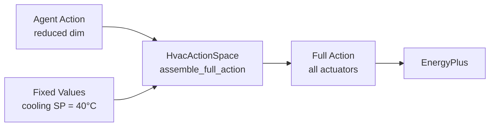

# Action Space

B2B environments expose continuous action spaces whose structure depends on the HVAC system type. This page describes the action space for each system type, the agent-facing vs. full action space distinction, and how actuators map to EnergyPlus.

---

## Action Space by HVAC Type

### Unitary Systems

Each unitary system exposes **2 actuators** per zone:

| Index | Actuator | Units | Lower | Upper |
|---|---|---|---|---|
| 0 | Fan Air Mass Flow Rate | kg/s | 0.0 | *design max* |
| 1 | Supply Air Temperature Setpoint | °C | 5.0 | *max supply temp* |

```python
# Example for a single-zone house
env.action_space
# Box(low=[0.0, 5.0], high=[0.48, 40.0], shape=(2,))
```

!!! info "Design-based bounds"

    The fan upper bound is read from the building's fan design data (converted from m³/s to kg/s at standard air density of 1.2 kg/m³). The SAT upper bound comes from `maximum_supply_air_temperature`, defaulting to 40°C.

### VAV Systems

VAV systems have a **shared supply temperature setpoint** plus **per-zone terminal actuators**:

| Actuator | Units | Lower | Upper | Count |
|---|---|---|---|---|
| Supply Air Temperature Setpoint | °C | 10.0 | 55.0 | 1 per AHU |
| Terminal Flow Fraction | fraction | 0.0 | 1.0 | 1 per zone |
| Zone Heating Setpoint | °C | 10.0 | 35.0 | 1 per zone |
| Zone Cooling Setpoint | °C | 18.0 | 40.0 | 1 per zone* |

For an OfficeMedium with 15 zones and 1 AHU, the full action space has:

- 1 supply temp + 15 flow fractions + 15 heating setpoints + 15 cooling setpoints = **46 dimensions**

!!! warning "Fixed cooling setpoints"

    VAV **cooling setpoints are removed from the agent-facing action space** and pinned at 40°C for simulation stability. The agent action space is therefore 1 + 15 + 15 = **31 dimensions** for this example.

### Baseboard Systems

Each baseboard exposes **1 binary actuator**:

| Index | Actuator | Units | Lower | Upper |
|---|---|---|---|---|
| 0 | Availability Schedule | discrete | 0 (off) | 1 (on) |

!!! note "Mixed systems"

    Buildings like `Warehouse` may have both unitary and baseboard equipment. In that case, the action space concatenates all actuators from all equipment in discovery order.

---

## Agent-Facing vs. Full Action Space

B2B distinguishes between two action spaces via the `HvacActionSpace` class:

### Full Action Space

The complete set of actuators needed by EnergyPlus, including fixed actuators. Used internally to drive the simulation.

### Agent Action Space

The reduced set of actuators exposed to the RL agent. Fixed actuators (currently VAV cooling setpoints) are removed and their values are pinned automatically.



The `assemble_full_action` method on `HvacActionSpace` takes the agent's action vector and inserts fixed values at the appropriate indices:

```python
# Agent produces a 31-dim action (no cooling setpoints)
agent_action = policy.predict(obs)

# HvacActionSpace expands to 46-dim with cooling SPs = 40°C
full_action = action_space.assemble_full_action(agent_action)
```

---

## `ActuatorDescription`

Each actuator in the action space is described by an `ActuatorDescription`:

```python
@dataclass(frozen=True)
class ActuatorDescription:
    component_type: str      # e.g. "Fan", "Schedule:Constant"
    control_type: str        # e.g. "Fan Air Mass Flow Rate", "Schedule Value"
    component_name: str      # Unique EnergyPlus object name
    units: str               # e.g. "[kg/s]", "Temperature", "Availability"
    lower_bound: float       # Action minimum
    upper_bound: float       # Action maximum
```

### Actuator Types by System

=== "Unitary"

    | component_type | control_type | units |
    |---|---|---|
    | `Fan` | `Fan Air Mass Flow Rate` | `[kg/s]` |
    | `Schedule:Constant` | `Schedule Value` | `Temperature` |

=== "VAV"

    | component_type | control_type | units |
    |---|---|---|
    | `Schedule:Constant` | `Schedule Value` | `[C]` (supply temp) |
    | `Schedule:Constant` | `Schedule Value` | `[frac]` (flow fraction) |
    | `Schedule:Constant` | `Schedule Value` | `[C]` (heating SP) |
    | `Schedule:Constant` | `Schedule Value` | `[C]` (cooling SP, fixed) |

=== "Baseboard"

    | component_type | control_type | units |
    |---|---|---|
    | `Schedule:Constant` | `Schedule Value` | `Availability` |

---

## Action Names

Action feature names are available via `env.metadata["action_names"]`:

```python
meta = env.metadata
for i, name in enumerate(meta["action_names"]):
    print(f"  [{i}] {name}")
```

Example output for a single-zone house:

```
  [0] Fan Air Mass Flow Rate :: DX HEATING COIL SYSTEM FAN
  [1] Schedule Value :: B2B outlet temp setpoint schedule (3)
```

---

## Action Space Dimensions by Building Type

| Building Type | HVAC | Agent Action Dim | Notes |
|---|---|---|---|
| Single-Zone Houses | Unitary | 2 | Fan + SAT |
| RestaurantFastFood | Unitary | 4 | 2 zones × 2 actuators |
| Warehouse | Unitary + Baseboard | 4–8 | Varies by zone/equipment count |
| RetailStandalone | Unitary | 8 | 4 zones × 2 actuators |
| OfficeSmall | Unitary | 10 | 5 zones × 2 actuators |
| HotelSmall | Unitary | 20+ | 10+ zones × 2 actuators |
| OfficeMedium | VAV | 31+ | 1 SAT + N×(flow + htg SP) |

!!! tip "Handling variable action spaces"

    For multi-building training across different building types, use the `PadObservation` wrapper for observations and consider building-type-specific policy heads or masking strategies for actions.

---

## Next Steps

- Learn about [reward functions](rewards.md) that evaluate the agent's actions
- See how to [normalize observations](wrappers.md) for training
- Configure action access via [Hydra configuration](configuration.md)
