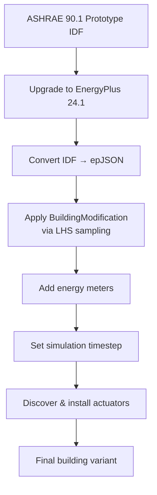

# Building Types & Climate Zones

B2B contains over 7,000 parametrically generated buildings spanning 7 building types, 16 climate zones, and 3 HVAC system types. This page describes the building types, climate zones, parametric generation process, and dataset structure.

---

## Building Types

B2B includes 6 ASHRAE 90.1-2022 commercial reference building prototypes plus single-zone residential houses:

| Building Type | Zones | HVAC System | Description |
|---|---|---|---|
| **OfficeSmall** | 5 | Unitary | Small office building with perimeter and core zones |
| **OfficeMedium** | 15+ | VAV | Medium office with multiple floors, VAV with reheat |
| **Warehouse** | 3 | Unitary + Heating-Only | Large open warehouse with office, fine-storage, and bulk-storage zones |
| **HotelSmall** | 10+ | Unitary | Small hotel with guest rooms, lobby, and mechanical rooms |
| **RetailStandalone** | 4 | Unitary | Standalone retail store with back/core/entry zones |
| **RestaurantFastFood** | 2 | Unitary | Fast-food restaurant with kitchen and dining zones |
| **Single-Zone Houses** | 1 | Unitary | Residential single-family detached houses |

!!! info "Dataset split"

    The `multizones_reference_buildings` dataset contains approximately **6,000 buildings** — roughly **1,000 per commercial building type**. The `single_zone_houses` dataset contains over **1,000** residential buildings.

---

## Climate Zones

Buildings are distributed across **16 ASHRAE climate zones**, each with a representative TMY3 weather file:

| Zone | Classification | Representative Location |
|---|---|---|
| 1A | Very Hot–Humid | Miami, FL |
| 2A | Hot–Humid | Houston, TX |
| 2B | Hot–Dry | Phoenix, AZ |
| 3A | Warm–Humid | Atlanta, GA |
| 3B | Warm–Dry | Las Vegas, NV |
| 3C | Warm–Marine | San Francisco, CA |
| 4A | Mixed–Humid | Baltimore, MD |
| 4B | Mixed–Dry | Albuquerque, NM |
| 4C | Mixed–Marine | Seattle, WA |
| 5A | Cool–Humid | Chicago, IL |
| 5B | Cool–Dry | Boulder, CO |
| 5C | Cool–Marine | Vancouver, BC |
| 6A | Cold–Humid | Minneapolis, MN |
| 6B | Cold–Dry | Helena, MT |
| 7 | Very Cold | Duluth, MN |
| 8 | Subarctic | Fairbanks, AK |

The climate zone determines the weather file used during simulation, creating dramatically different heating/cooling challenges for the same building type.

---

## Parametric Generation

Each building in the dataset is a unique variant generated from an ASHRAE 90.1-2022 prototype through parametric modifications. The generation process uses **Latin Hypercube Sampling** (LHS) to systematically explore the parameter space.

### Modification Parameters

The `BuildingModification` dataclass controls the following parameters:

| Parameter | Type | Description |
|---|---|---|
| `envelope_conductivity_scale` | `float` | Multiplicative scale on wall/roof material conductivity |
| `window_u_factor` | `float` | Window thermal transmittance (W/m²·K) |
| `window_shgc` | `float` | Window Solar Heat Gain Coefficient |
| `fenestration_to_wall_ratio` | `float` | Target window-to-wall area ratio |
| `infiltration_scale` | `float` | Multiplicative scale on infiltration flow rates |
| `north_axis` | `float` | Building rotation (degrees) |
| `scale_x` | `float` | Geometry scale factor in X direction |
| `scale_y` | `float` | Geometry scale factor in Y direction |
| `scale_z` | `float` | Geometry scale factor in Z direction |

### Generation Pipeline



The pipeline processes each building through:

1. **Upgrade**: Convert legacy IDF format to EnergyPlus 24.1
2. **Convert**: Transform IDF to the JSON-based epJSON format
3. **Modify**: Apply parametric modifications (envelope, fenestration, geometry, infiltration)
4. **Instrument**: Add HVAC energy meters, set simulation timestep (default: 5 minutes), discover equipment, and install controllable actuators

---

## Datasets

B2B organizes buildings into two datasets:

### `single_zone_houses`

Single-family detached residential houses with one thermal zone each.

- **HVAC**: Unitary heat pump systems
- **Control interface**: Fan air mass flow rate + supply air temperature setpoint
- **Use cases**: Single-task RL, rapid prototyping, algorithm debugging

### `multizones_reference_buildings`

Multi-zone ASHRAE 90.1 commercial reference buildings with varying zone counts.

- **6 building types** × ~1,000 buildings each ≈ 6,000 buildings
- **HVAC**: VAV (OfficeMedium), Unitary (most types), Heating-Only (Warehouse bulk storage)
- **Zone count**: 2–15+ zones depending on building type
- **Use cases**: Multi-task learning, cross-environment transfer, action-space shift

---

## Dataset Selection

The `DatasetSelectionConfig` provides five modes for selecting buildings:

### `split_index`

Select a single building by its index within a train/test split:

```python
DatasetSelectionConfig(
    dataset="single_zone_houses",
    split="train",
    mode="split_index",
    split_index=42,
)
```

### `split_indices`

Select multiple specific buildings by their indices:

```python
DatasetSelectionConfig(
    dataset="multizones_reference_buildings",
    building_type="OfficeSmall",
    split="train",
    mode="split_indices",
    split_indices=[0, 5, 10, 15, 20],
)
```

### `random`

Sample buildings uniformly at random:

```python
DatasetSelectionConfig(
    dataset="multizones_reference_buildings",
    building_type="Warehouse",
    split="train",
    mode="random",
    sample_size=10,
    seed=42,
    replace=False,
)
```

### `metadata_query`

Select buildings matching metadata criteria:

```python
DatasetSelectionConfig(
    dataset="multizones_reference_buildings",
    split="train",
    mode="metadata_query",
    metadata_query={"climate_zone": "5A", "building_type": "OfficeMedium"},
)
```

### `building_id`

Select a building by its unique database ID (bypasses splits):

```python
DatasetSelectionConfig(
    dataset="multizones_reference_buildings",
    mode="building_id",
    building_id=1234,
    split=None,
)
```

---

## Train/Test Splits

Each dataset is pre-split into training and test sets:

- **Train split**: Used for policy training and hyperparameter tuning
- **Test split**: Held out for evaluation — never used during training
- **Test-small split** *(multizones only)*: A compact subset of the test split with exactly one building per ASHRAE climate zone (8 buildings total). Useful for quick evaluation sweeps across all climates.

This enables rigorous evaluation of cross-building generalization. A policy trained on the train split should be evaluated on unseen buildings from the test split to measure true transfer performance.

```python
# Training
train_env = make_single_zone_env(split="train", split_index=0, ...)

# Evaluation (different buildings)
test_env = make_single_zone_env(split="test", split_index=0, ...)

# Quick evaluation across all climate zones (multizones only)
test_small_env = make_multizones_env(split="test_small", index=0, ...)
```

---

## Next Steps

- Learn about the [HVAC system types](hvac-systems.md) and their control interfaces
- Understand how buildings map to [observation spaces](observations.md) and [action spaces](actions.md)
