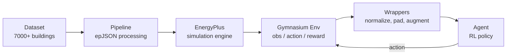

# Environment Overview

B2B environments wrap EnergyPlus building simulations in the Gymnasium interface. This page describes the architecture, factory functions, configuration, and environment lifecycle.

---

## Architecture



The B2B environment pipeline:

1. **Dataset**: Select a building from `single_zone_houses` or `multizones_reference_buildings` by split and index
2. **Pipeline**: Process the building's epJSON file — discover HVAC equipment, install controllable actuators, add observation meters, set the simulation timestep
3. **EnergyPlus**: Launch the EnergyPlus simulator with the modified building model and weather file
4. **Gymnasium Env**: Wrap the simulation in a standard `gym.Env` with `Box` observation and action spaces
5. **Wrappers**: Optionally normalize observations, pad to fixed size, augment with building parameters
6. **Agent**: The RL policy receives observations and returns actions at each simulation timestep (default: 5 minutes)

---

## Environment Registration

B2B environments are registered with Gymnasium as `EnergyPlus-v0`. However, the recommended way to create environments is through the factory functions in `b2b.api`, which handle all configuration and pipeline setup.

---

## Factory Functions

B2B provides four levels of environment creation, from high-level convenience to low-level control:

### `make_single_zone_env`

Create a single-zone house environment from scalar arguments:

```python
from b2b.api import make_single_zone_env

env = make_single_zone_env(
    split="train",
    split_index=0,
    eplus_output_dir="outputs/eplus",
    task={"run_period": "winter"},
    reward={"reward_type": "BarrierRewardConfig"},
    max_steps=8640,
)
```

| Parameter | Type | Description |
|---|---|---|
| `split` | `"train"` \| `"test"` | Dataset split |
| `split_index` | `int` | Zero-based index into the split |
| `eplus_output_dir` | `str \| Path` | EnergyPlus output directory |
| `task` | `dict \| None` | Task config (run period, target temps) |
| `reward` | `dict \| None` | Reward config (type, weights) |
| `max_steps` | `int \| None` | Max episode length (defaults to run period) |

### `make_multizones_env`

Create a multi-zone reference building environment:

```python
from b2b.api import make_multizones_env

env = make_multizones_env(
    building_type="OfficeSmall",
    split="train",
    split_index=0,
    eplus_output_dir="outputs/eplus",
    task={"run_period": "summer"},
    reward={"reward_type": "DeadbandRewardConfig", "dT": 1.0},
)
```

Takes the same parameters as `make_single_zone_env` plus `building_type`.

### `make_env`

Create an environment from a fully-specified `EnvBuildConfig`:

```python
from b2b.api import make_env
from b2b.config.models import DatasetSelectionConfig, EnvBuildConfig
from b2b.types import TaskConfig, reward_config_from_dict

cfg = EnvBuildConfig(
    dataset_selection=DatasetSelectionConfig(
        dataset="multizones_reference_buildings",
        building_type="Warehouse",
        split="train",
        mode="split_index",
        split_index=0,
    ),
    task=TaskConfig.from_dict({"run_period": "full_year"}),
    reward=reward_config_from_dict({"reward_type": "BaseRewardConfig", "energy_weight": 1.0}),
)
env = make_env(cfg, eplus_output_dir="outputs/eplus")
```

### `make_env_from_config`

The lowest-level factory used internally by all other functions. Handles dataset lookup, pipeline execution, and `TimeLimit` wrapping.

---

## `EnvBuildConfig`

The central configuration dataclass that specifies how to build an environment:

```python
@dataclass(frozen=True)
class EnvBuildConfig:
    dataset_selection: DatasetSelectionConfig  # Which building(s) to use
    task: TaskConfig                           # Run period, target temperatures
    reward: RewardConfig                       # Reward function type and weights
    actuator_access: ActuatorAccessConfig       # Which actuators to expose
    env_max_steps: int | None = None           # Override max episode steps
```

### `DatasetSelectionConfig`

Controls which building is selected from the dataset:

| Field | Type | Default | Description |
|---|---|---|---|
| `dataset` | `"single_zone_houses"` \| `"multizones_reference_buildings"` | — | Dataset to query |
| `split` | `"train"` \| `"test"` \| `"test_small"` \| `None` | `"train"` | Dataset split (`test_small`: one per climate zone, multizones only) |
| `mode` | `SelectionMode` | `"split_index"` | How to select buildings |
| `split_index` | `int` | `0` | Index when mode is `split_index` |
| `split_indices` | `list[int]` | `[]` | Indices when mode is `split_indices` |
| `building_id` | `int \| None` | `None` | Direct building ID |
| `sample_size` | `int` | `1` | Number of buildings for `random` mode |
| `seed` | `int \| None` | `None` | RNG seed for `random` mode |
| `building_type` | `BuildingType \| None` | `None` | Filter by building type |

### `TaskConfig`

Controls the simulation task:

| Field | Type | Default | Description |
|---|---|---|---|
| `run_period` | `RunPeriodConfig` | `full_year` | Simulation period |
| `target_temperature_mode` | `"constant"` \| `"occupancy"` | `"constant"` | How target temps are determined |
| `timesteps_per_hour` | `int` | `12` | Simulation steps per hour (5-min default) |
| `default_zone_target_temperature` | `ZoneTargetTemperatureConfig` | `21.0°C / 21.0°C` | Default occupied/unoccupied targets |
| `zone_target_temperatures` | `dict[str, ZoneTargetTemperatureConfig]` | `{}` | Per-zone overrides |

### Run Periods

| Name | Period | Days | Steps (at 5 min) |
|---|---|---|---|
| `full_year` | Jan 1 – Dec 31 | 365 | 105,120 |
| `winter` | Jan 1 – Mar 31 | 90 | 25,920 |
| `summer` | Jun 1 – Aug 31 | 92 | 26,496 |

---

## Environment Lifecycle

### Reset

```python
obs, info = env.reset()
```

Calling `reset()` initializes (or re-initializes) the EnergyPlus simulation. The first observation is returned after the simulation warmup completes. The `info` dict may contain metadata about the building.

### Step

```python
obs, reward, terminated, truncated, info = env.step(action)
```

Each `step()` advances the EnergyPlus simulation by one timestep (default: 5 minutes, configurable via `task.timesteps_per_hour`). The action is applied to the HVAC actuators, and the resulting observation, reward, and termination signals are returned.

- **`terminated`**: Always `False` (the simulation does not terminate early)
- **`truncated`**: `True` when `max_episode_steps` is reached (via `TimeLimit` wrapper)

### Close

```python
env.close()
```

Shuts down the EnergyPlus process and cleans up resources. Always call `close()` when finished with an environment.

---

## Environment Metadata

B2B environments expose metadata through `env.metadata`:

```python
meta = env.metadata
print(meta["observation_names"])   # List of observation feature names
print(meta["action_names"])        # List of actuator names
print(meta["controlled_zones"])    # List of zone names under control
print(meta["area"])                # Building floor area (m²)
print(meta["building_source_metadata"])  # Dataset provenance info
```

This metadata is used by wrappers (e.g., `PadObservation` uses zone temperature names for intelligent padding) and by baseline controllers for actuator indexing.

---

## Next Steps

- Learn about the [7,000+ buildings](buildings.md) in the dataset
- Understand the [HVAC systems](hvac-systems.md) and their control interfaces
- Explore the [observation space](observations.md) and [action space](actions.md)
