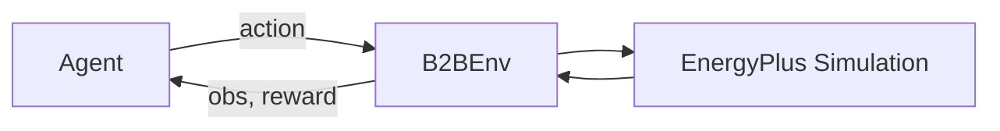

# Environments

## Overview

B2B environments are standard Gymnasium environments backed by EnergyPlus
simulations. Each environment simulates a building with controllable HVAC
actuators, returning observations (temperatures, energy use, weather) and a
scalar reward at each timestep.



## Creating Environments

### `new_make_env` (recommended)

The primary user-facing API. Downloads pre-processed buildings from HuggingFace,
resolves named task presets, and constructs the environment:

```python
import building2building as b2b

env = b2b.new_make_env(
    "OfficeSmall",
    split="train",
    index=0,
    task="task1",
    run_period="winter",
)
```

**Parameters:**

| Parameter | Type | Description |
|---|---|---|
| `building_type` | `str` | One of the 6 building types |
| `split` | `"train"` / `"test"` | Dataset split |
| `index` | `int` | Zero-based index into the split |
| `building_id` | `str` | Explicit building ID (overrides split+index) |
| `task` | `str` / `TaskPreset` | `"task1"`--`"task4"` or a `TaskPreset` |
| `reward` | `RewardConfig` | Override reward (default: from task preset) |
| `run_period` | `str` | `"full_year"`, `"winter"`, or `"summer"` |
| `timesteps_per_hour` | `int` | Simulation resolution (default: 12 = 5 min) |
| `target_temperature_mode` | `str` | `"constant"` or `"occupancy"` |
| `eplus_output_dir` | `str` / `Path` | EnergyPlus output directory |
| `max_episode_steps` | `int` | Override episode length |

### `make_env` (config-based)

For full control, construct an `EnvBuildConfig` manually:

```python
from building2building.api import make_env
from building2building.config.models import DatasetSelectionConfig, EnvBuildConfig
from building2building.types import TaskConfig, reward_config_from_dict

cfg = EnvBuildConfig(
    dataset_selection=DatasetSelectionConfig(
        building_type="OfficeMedium",
        split="train",
        mode="split_index",
        split_index=5,
    ),
    task=TaskConfig.from_dict({"run_period": "summer"}),
    reward=reward_config_from_dict({"reward_type": "BarrierRewardConfig", "energy_weight": 0.1}),
    env_max_steps=8640,
)
env = make_env(cfg, eplus_output_dir="outputs/eplus")
```

### Gymnasium Registration

B2B environments are also registered as Gymnasium environments:

```python
import gymnasium as gym

env = gym.make("b2b/OfficeSmall-v0", split="train", index=0, task="task1")
```

## Environment Lifecycle

```python
env = b2b.new_make_env("OfficeSmall", task="task1")

obs, info = env.reset()         # Start EnergyPlus simulation
for _ in range(100):
    action = env.action_space.sample()
    obs, reward, terminated, truncated, info = env.step(action)
    if terminated or truncated:
        obs, info = env.reset()
env.close()                     # Clean up EnergyPlus process
```

- `reset()` starts a new EnergyPlus simulation and runs warmup.
- `step(action)` advances the simulation by one timestep.
- `close()` terminates the EnergyPlus process and cleans up.
- `terminated` is True when the simulation run period ends.

## Environment Metadata

Every environment provides structured metadata:

```python
env.metadata["observation_names"]      # list[str] -- named observation channels
env.metadata["action_names"]           # list[str] -- named action channels
env.metadata["hvac_equipment"]         # list[Equipment] -- HVAC equipment descriptions
env.metadata["morphology"]             # Morphology -- structured graph representation
env.metadata["total_conditioned_area"] # float -- building floor area (m^2)
env.metadata["zone_names"]             # list[str] -- thermal zone names
```

## Run Periods

| Period | Start | End | Steps (5-min) |
|---|---|---|---|
| `full_year` | Jan 1 | Dec 31 | 105,120 |
| `winter` | Jan 1 | Mar 31 | 25,920 |
| `summer` | Jun 1 | Aug 31 | 26,496 |
