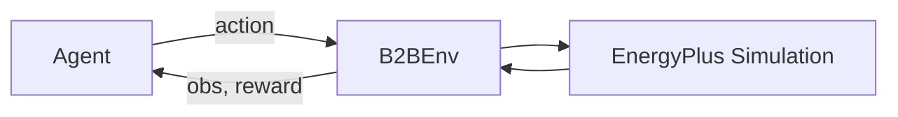

# Environments

## Overview

B2B environments are standard Gymnasium environments backed by EnergyPlus
simulations. Each environment simulates a building with controllable HVAC
actuators, returning observations (temperatures, energy use, weather) and a
scalar reward at each timestep.



## Creating Environments

### `make_env` (recommended)

The primary user-facing API. Downloads pre-processed buildings from HuggingFace,
resolves named task presets, and constructs the environment:

```python
import building2building as b2b

env = b2b.make_env(
    "OfficeSmall",
    split="train",
    index=0,
    task="task_const_e0",
    run_period="winter",
)
```

**Parameters:**

| Parameter | Type | Description |
|---|---|---|
| `building_type` | `str` | One of the 6 building types |
| `split` | `"train"` / `"test"` / `"test_small"` | Dataset split |
| `index` | `int` | Zero-based index into the split |
| `building_id` | `str` | Explicit building ID (overrides split+index) |
| `task` | `str` / `TaskPreset` | preset name (one of the 6 `task_{const,occ,rand}_{e0,e05}` presets) or a `TaskPreset` |
| `reward` | `RewardConfig` | Override reward (default: from task preset) |
| `run_period` | `str` | `"full_year"`, `"winter"`, or `"summer"` |
| `normalizer_path` | `Path` | Alternate `reward_normalizers.yaml` for resolving `(tau_T, tau_E)` (default: packaged file) |
| `timesteps_per_hour` | `int` | Simulation resolution (default: 12 = 5 min) |
| `target_temperature_mode` | `str` | `"constant"`, `"occupancy"`, or `"random_schedule"` (default: from task preset) |
| `random_schedule_seed` | `int` | Base seed for the `task_rand_*` daily schedule generator |
| `eplus_output_dir` | `str` / `Path` | EnergyPlus output directory |
| `max_episode_steps` | `int` | Override episode length |
| `rescale_action` | `bool` | Wrap with `RescaleAction` so actions are in `[-1, 1]` (default: `False`) |

For the 6 task presets, `make_env` auto-fills the reward's `(tau_T, tau_E)`
normalizers from `building2building/data/reward_normalizers.yaml` for the
building's `(building_type, climate_zone)` bucket. `tau_E` is calibrated per
run period; requesting a `run_period` that has no section in that YAML raises
at env-build time.

### `make_env_from_config` (config-based)

For full control, construct an `EnvBuildConfig` manually:

```python
from building2building.api import make_env_from_config
from building2building.config.models import DatasetSelectionConfig, EnvBuildConfig
from building2building.types import TaskConfig, reward_config_from_dict

cfg = EnvBuildConfig(
    dataset_selection=DatasetSelectionConfig(
        building_type="OfficeMedium",
        split="train",
        mode="split_index",
        split_index=5,
    ),
    task=TaskConfig.from_dict({"run_period": "summer"}),
    reward=reward_config_from_dict(
        {
            "reward_type": "NormalizedRewardConfig",
            "energy_weight": 0.5,
            "tau_T": 1.0,
            "tau_E": 2.0,
        }
    ),
    env_max_steps=8640,
)
env = make_env_from_config(cfg, eplus_output_dir="outputs/eplus")
```

Unlike `make_env`, this path does **not** auto-fill the reward normalizers:
`tau_T` and `tau_E` must be given explicitly (an unfilled config raises at
simulator construction). `tau_T` is always `1.0` (comfort is unnormalized);
`tau_E` values per `(building_type, climate_zone, run_period)` live in
`building2building/data/reward_normalizers.yaml`.

### Gymnasium Registration

B2B environments are also registered as Gymnasium environments:

```python
import gymnasium as gym

env = gym.make("b2b/OfficeSmall-v0", split="train", index=0, task="task_const_e0")
```

## Environment Lifecycle

```python
env = b2b.make_env("OfficeSmall", task="task_const_e0")

obs, info = env.reset()         # Start EnergyPlus simulation
for _ in range(100):
    action = env.action_space.sample()
    obs, reward, terminated, truncated, info = env.step(action)
    if terminated or truncated:
        obs, info = env.reset()
env.close()                     # Clean up EnergyPlus process
```

- `reset()` starts a new EnergyPlus simulation and runs warmup.
- `step(action)` advances the simulation by one timestep.
- `close()` terminates the EnergyPlus process and cleans up.
- Episodes end when the simulated run period completes; `make_env` also wraps
  the env in a `gym.wrappers.TimeLimit` sized to the run period, so check both
  `terminated` and `truncated`.

## Environment Metadata

Every environment provides structured metadata:

```python
env.metadata["observation_names"]   # list[str] -- named observation channels
env.metadata["action_names"]        # list[str] -- named action channels
env.metadata["hvac_equipment"]      # list[Equipment] -- HVAC equipment descriptions
env.metadata["morphology"]          # Morphology -- structured graph representation
env.metadata["area"]                # float -- net conditioned floor area (m^2)
env.metadata["controlled_zones"]    # list[str] -- fully controlled zone names
env.metadata["heating_only_zones"]  # list[str] -- heating-only zone names
env.metadata["uncontrolled_zones"]  # list[str] -- zones without HVAC control
env.metadata["task_config"]         # TaskConfig -- resolved task specification
env.metadata["building_info"]       # BuildingInfo -- registry entry for the building
```

## Run Periods

| Period | Start | End | Steps (5-min) |
|---|---|---|---|
| `full_year` | Jan 1 | Dec 31 | 105,120 |
| `winter` | Jan 1 | Mar 31 | 25,920 |
| `summer` | Jun 1 | Aug 31 | 26,496 |
