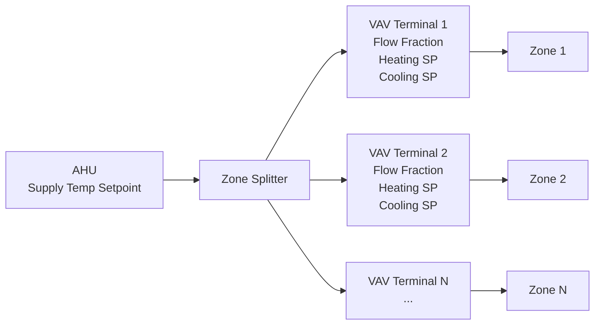
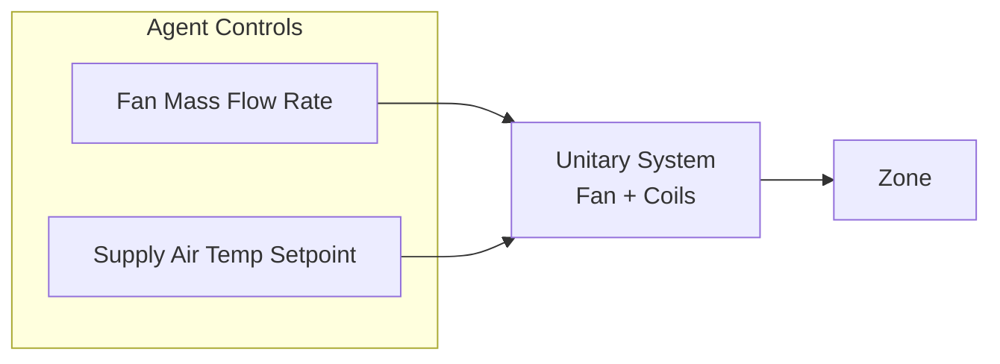
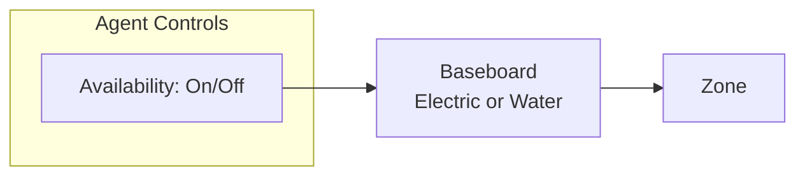
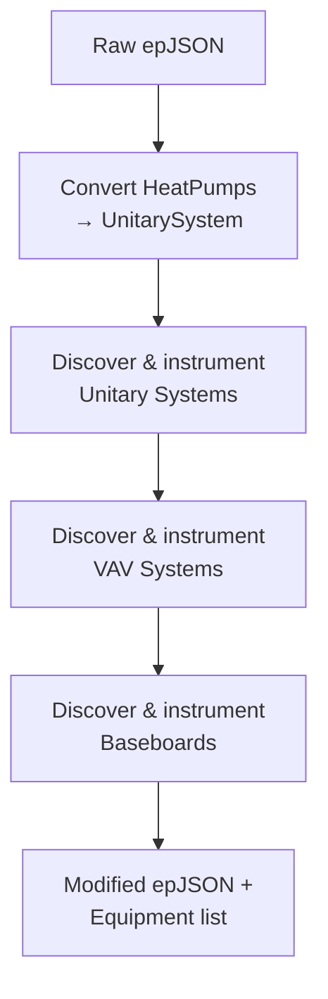

# HVAC System Types

B2B supports three distinct HVAC system types, each with a different control interface. This page describes how each system works, what actuators it exposes, and how equipment is discovered and instrumented.

---

## Overview

| System | Buildings | Actuators per Zone | Control Strategy |
|---|---|---|---|
| **VAV** (Variable Air Volume) | OfficeMedium | Supply temp setpoint + per-zone flow fraction, heating/cooling setpoints | Central AHU with zone-level terminal units |
| **Unitary** | OfficeSmall, HotelSmall, RetailStandalone, RestaurantFastFood, single-zone houses | Fan mass flow rate + supply air temperature setpoint | Dedicated unit per zone |
| **Baseboard** | Warehouse (supplemental) | On/off availability schedule | Simple convective heating |

---

## VAV (Variable Air Volume)

VAV systems use a central Air Handling Unit (AHU) that supplies conditioned air to multiple zones through terminal units with variable dampers and reheat coils.

### Architecture



### Equipment Classes

**`VAVSystem`** — Represents one AHU loop with its terminals:

- `supply_temp_setpoint`: Controls the AHU discharge air temperature
- `terminals`: List of `VAVTerminal` objects, one per zone

**`VAVTerminal`** — Represents one zone's terminal unit:

- `flow_fraction`: Damper position controlling airflow to the zone [0, 1]
- `heating_setpoint`: Zone thermostat heating setpoint [10°C, 35°C]
- `cooling_setpoint`: Zone thermostat cooling setpoint [18°C, 40°C]

### Actuator Bounds

| Actuator | Units | Lower | Upper |
|---|---|---|---|
| Supply air temperature setpoint | °C | 10.0 | 55.0 |
| Terminal flow fraction | fraction | 0.0 | 1.0 |
| Zone heating setpoint | °C | 10.0 | 35.0 |
| Zone cooling setpoint | °C | 18.0 | 40.0 |

!!! note "Fixed cooling setpoints"

    By default, **VAV cooling setpoints are fixed at 40°C** and removed from the agent-facing action space. This follows the OfficeRL convention for simulation stability. See [Action Space](actions.md) for details on the agent-facing vs. full action space split.

### How VAV Systems Are Discovered

The pipeline uses SPARQL queries over the building's ontology graph to trace the chain:

1. `ZoneHVAC:EquipmentConnections` → zone to equipment list
2. `ZoneHVAC:EquipmentList` → equipment list to Air Distribution Unit
3. `ZoneHVAC:AirDistributionUnit` → ADU to `AirTerminal:SingleDuct:VAV:Reheat`
4. `AirLoopHVAC:ZoneSplitter` → terminal inlet to splitter
5. `AirLoopHVAC` → loop to supply outlet node

For each loop, the pipeline:

- Removes pre-existing EMS thermostat overrides (ASHRAE optimum-start programs)
- Installs `SetpointManager:Scheduled` on the supply outlet node
- Converts terminal damper control to `"Scheduled"` mode
- Replaces thermostat setpoint schedules with controllable `Schedule:Constant` objects

---

## Unitary Systems

Unitary systems are self-contained HVAC units — each serves a single zone with its own fan, heating coil, and cooling coil.

### Architecture



### Equipment Class

**`UnitarySystem`** — Represents one zone's unitary HVAC:

- `zone`: The zone name served by this system
- `actuators`: List of `ActuatorDescription` objects (typically 2: fan + SAT)

### Actuator Bounds

| Actuator | Units | Lower | Upper |
|---|---|---|---|
| Fan air mass flow rate | kg/s | 0.0 | *design max* (read from epJSON) |
| Supply air temperature setpoint | °C | 5.0 | *max supply temp* (default 40°C) |

!!! info "Design-based bounds"

    The upper bound for fan mass flow rate is read from the building's `Fan:SystemModel` or `Fan:OnOff` design data. If unavailable, a default of 1.0 kg/s is used. The SAT upper bound comes from the system's `maximum_supply_air_temperature` field, defaulting to 40°C.

### Supported EnergyPlus Types

The pipeline handles two EnergyPlus object types:

- `AirLoopHVAC:UnitarySystem` — Modern setpoint-controlled systems
- `AirLoopHVAC:UnitaryHeatPump:AirToAir` — Automatically converted to `UnitarySystem` with `control_type="SetPoint"` before instrumentation

### How Unitary Systems Are Discovered

Similar to VAV, SPARQL queries trace from zones through `AirTerminal:SingleDuct:ConstantVolume:NoReheat` terminals to the `AirLoopHVAC:UnitarySystem` on the supply branch.

For each discovered system, the pipeline:

- Sets `control_type` to `"SetPoint"`
- Configures fan operating mode schedule
- Installs a controllable `SetpointManager:Scheduled` on the outlet node
- Locks out DX cooling compressor below 10°C outdoor air temperature

---

## Baseboard

Baseboard systems provide simple zone-level heating through electric resistance or hot water convectors.

### Architecture



### Equipment Class

**`Baseboard`** — Represents one baseboard heater:

- `actuator`: A single `ActuatorDescription` for on/off availability

### Actuator Bounds

| Actuator | Units | Lower | Upper |
|---|---|---|---|
| Availability schedule | discrete | 0 (off) | 1 (on) |

### Supported EnergyPlus Types

- `ZoneHVAC:Baseboard:Convective:Electric`
- `ZoneHVAC:Baseboard:Convective:Water`

---

## The `Equipment` Protocol

All HVAC equipment types implement the `Equipment` protocol defined in `b2b.types`:

```python
class Equipment(Protocol):
    def actuator_descriptions(self) -> list[ActuatorDescription]: ...
    def zones(self) -> list[str]: ...
```

- `actuator_descriptions()` returns the list of controllable actuators for this equipment
- `zones()` returns the list of thermal zones served by this equipment

### `ActuatorDescription`

Each controllable actuator is described by:

```python
@dataclass(frozen=True)
class ActuatorDescription:
    component_type: str      # EnergyPlus component type (e.g. "Fan", "Schedule:Constant")
    control_type: str        # Control variable (e.g. "Fan Air Mass Flow Rate", "Schedule Value")
    component_name: str      # Unique EnergyPlus object name
    units: str               # Physical units
    lower_bound: float       # Minimum allowed value
    upper_bound: float       # Maximum allowed value
```

---

## Equipment Discovery Pipeline

The `make_all_equipment` function in `b2b.pipeline.actuators` orchestrates the full discovery process:



1. **Convert heat pumps**: `AirLoopHVAC:UnitaryHeatPump:AirToAir` → `AirLoopHVAC:UnitarySystem`
2. **Instrument unitary**: Discover and install fan + SAT actuators
3. **Instrument VAV**: Discover AHU loops and install supply temp + terminal actuators
4. **Instrument baseboard**: Discover baseboards and install availability schedule actuators

The result is a modified epJSON file ready for simulation and a list of `Equipment` objects describing all controllable actuators.

---

## Next Steps

- See how equipment maps to the [action space](actions.md)
- Understand the [observation space](observations.md) available to the agent
- Learn about [reward functions](rewards.md) for HVAC control
