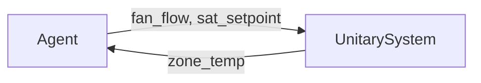
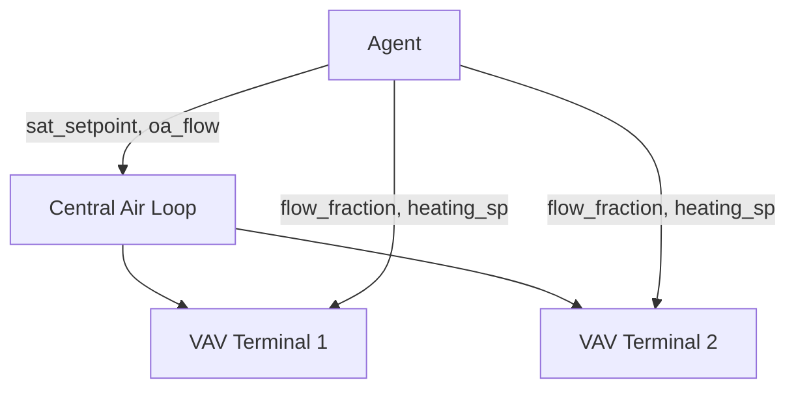

# HVAC System Types

## Overview

B2B environments expose three types of HVAC systems, each with different
observation/action interfaces:

| System | Building Types | Control Interface |
|---|---|---|
| **Unitary** | SingleFamilyHouse, OfficeSmall, RetailStandalone, RestaurantFastFood, Warehouse | Fan flow rate + supply air temperature per zone (heat pumps: thermostat setpoints) |
| **VAV (Variable Air Volume)** | OfficeMedium | Per-zone flow fraction/setpoints + central supply air temperature and outdoor-air flow |
| **Heating-Only** | Warehouse (subset of zones) | Heating setpoint only |

## Unitary Systems

Packaged single-zone systems where each zone has its own air handling unit.



**Actuators per zone:**

| Actuator | Range | Unit |
|---|---|---|
| Fan air mass flow rate | `[0, design_max]` | kg/s |
| Supply air temperature setpoint | `[5, design_max]` (fallback upper bound 50) | C |

**Equipment classes:** `UnitarySystem`, `HeatPump`

Air-to-air heat pumps (used by `SingleFamilyHouse`) are load-based and are
controlled through heating/cooling thermostat setpoints instead of fan flow
and supply air temperature.

## VAV Systems

Central air-loop systems with per-zone VAV terminals.



**Central actuators:**

| Actuator | Range | Unit |
|---|---|---|
| Supply air temperature setpoint | `[10, 55]` | C |
| Outdoor-air mass flow rate | `[0, design_max]` | kg/s |

**Per-zone terminal actuators:**

| Actuator | Range | Unit |
|---|---|---|
| Minimum air-flow fraction (damper) | `[0, 1]` | fraction |
| Heating setpoint | `[10, 35]` | C |

Each terminal also carries a cooling-setpoint actuator, but it is removed from
the agent-facing action space and pinned at 40 C for simulation stability.

**Equipment classes:** `VAVSystem`, `VAVTerminal`

## Heating-Only Zones

Zones with only a heating element (unit heater, baseboard, or radiant system).

**Actuators per zone:**

| Actuator | Range | Unit |
|---|---|---|
| Heating setpoint | `[10, 35]` | C |

**Equipment class:** `HeatingOnlyZone`

!!! note

    Heating-only zones can be optionally hidden from the agent using the
    `expose_heating_only_zones` parameter in `EnvBuildConfig` (default
    `True`); when hidden, their setpoints are pinned at 18 C.

## Equipment Discovery

HVAC equipment is automatically discovered from the EnergyPlus model during the
building preparation pipeline. The discovered equipment is serialized in
`equipment.json` alongside each building. At environment creation time, this
file is loaded to configure observation and action spaces.

## Equipment Protocol

All HVAC equipment classes implement the `Equipment` protocol defined in
`building2building.types`:

```python
class Equipment(Protocol):
    def actuator_descriptions(self) -> list[ActuatorDescription]: ...
    def zones(self) -> list[str]: ...
```

Each `ActuatorDescription` specifies the EnergyPlus component type, control
type, component name, units, and value bounds.
