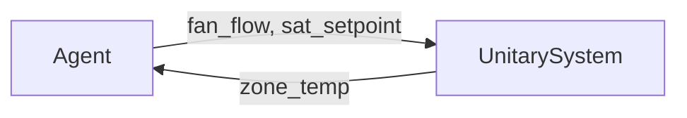
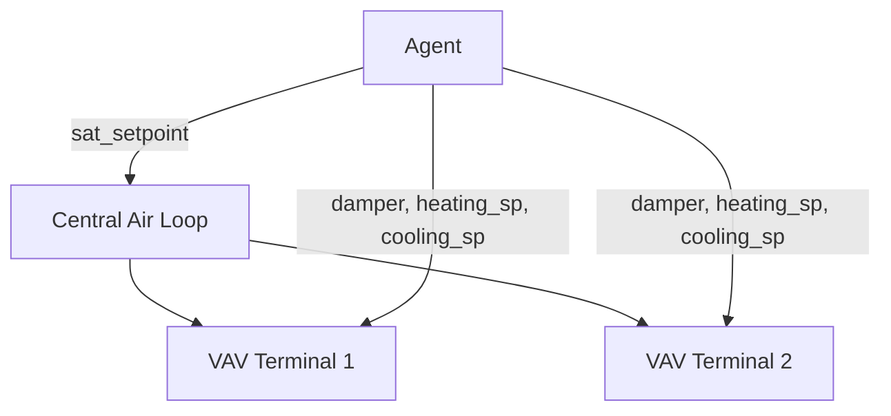

# HVAC System Types

## Overview

B2B environments expose three types of HVAC systems, each with different
observation/action interfaces:

| System | Building Types | Control Interface |
|---|---|---|
| **Unitary** | SingleFamilyHouse, OfficeSmall, RetailStandalone, RestaurantFastFood, Warehouse | Fan flow rate + supply air temperature per zone |
| **VAV (Variable Air Volume)** | OfficeMedium | Per-zone damper/setpoints + central supply air temperature |
| **Heating-Only** | Various (subset of zones) | Heating setpoint only |

## Unitary Systems

Packaged single-zone systems where each zone has its own air handling unit.



**Actuators per zone:**

| Actuator | Range | Unit |
|---|---|---|
| Fan air mass flow rate | `[0, design_max]` | kg/s |
| Supply air temperature setpoint | `[12, 50]` | C |

**Equipment class:** `UnitarySystem`

## VAV Systems

Central air-loop systems with per-zone VAV terminals.



**Central actuators:**

| Actuator | Range | Unit |
|---|---|---|
| Supply air temperature setpoint | `[12, 50]` | C |

**Per-zone terminal actuators:**

| Actuator | Range | Unit |
|---|---|---|
| Damper position | `[0, 1]` | fraction |
| Heating setpoint | `[15, 30]` | C |
| Cooling setpoint | `[15, 30]` | C |

**Equipment classes:** `VAVSystem`, `VAVTerminal`

## Heating-Only Zones

Zones with only a heating element (unit heater, baseboard, or radiant system).

**Actuators per zone:**

| Actuator | Range | Unit |
|---|---|---|
| Heating setpoint | `[15, 30]` | C |

**Equipment class:** `HeatingOnlyZone`

!!! note

    Heating-only zones can be optionally hidden from the agent using the
    `expose_heating_only_zones` parameter in `EnvBuildConfig`.

## Equipment Discovery

HVAC equipment is automatically discovered from the EnergyPlus model during the
building preparation pipeline. The discovered equipment is serialized in
`equipment.json` alongside each building. At environment creation time, this
file is loaded to configure observation and action spaces.

## Equipment Protocol

All HVAC equipment classes implement the `Equipment` protocol defined in
`building2building.types`:

```python
class Equipment(Protocol):
    zone_name: str
    actuators: list[ActuatorDescription]
```

Each `ActuatorDescription` specifies the EnergyPlus actuator type, component
name, control variable, and value bounds.
