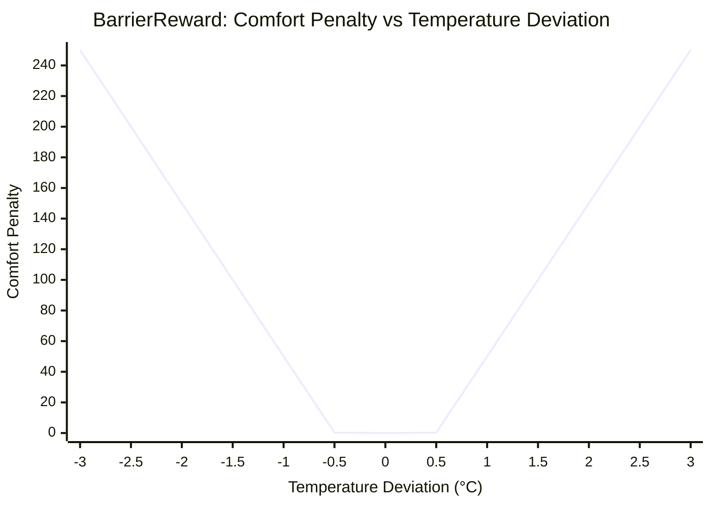

# Reward Functions

B2B provides three reward functions that trade off temperature comfort against energy consumption. All rewards are negative (penalties), with values closer to zero indicating better performance.

---

## Overview

| Reward | Key Idea | Best For |
|---|---|---|
| **BaseReward** | MSE temperature error + weighted energy | Simple baselines, direct optimization |
| **BarrierReward** | Deadband comfort zone with violation penalty | Safety-critical, hard comfort constraints |
| **DeadbandReward** | Quadratic inside deadband, linear outside | Smooth learning, avoiding bang-bang behavior |

All reward functions share the same structure:

\[
r_t = -\bigl(\text{comfort\_penalty}_t + w \cdot \text{energy\_penalty}_t\bigr)
\]

where \(w\) is the `energy_weight` parameter and the energy penalty is:

\[
\text{energy\_penalty} = \text{electricity}_{t} + \text{gas}_{t} \quad \text{(Wh/m² per timestep)}
\]

---

## BaseReward

The simplest reward function. Penalizes the mean squared error between zone temperatures and their targets, plus a weighted energy term.

### Formula

\[
r_t = -\left(\frac{1}{N}\sum_{i=1}^{N}(T_i - T_i^*)^2 + w \cdot E_t\right)
\]

where:

- \(N\) = number of controlled zones
- \(T_i\) = current air temperature in zone \(i\) (°C)
- \(T_i^*\) = target temperature for zone \(i\) (°C)
- \(E_t\) = total HVAC energy consumption (Wh/m²)
- \(w\) = `energy_weight`

### Configuration

```python
from building2building.types import BaseRewardConfig

reward = BaseRewardConfig(energy_weight=1.0)
```

```yaml
# configs/reward/base.yaml
reward_type: BaseRewardConfig
energy_weight: 1.0
```

### Behavior

- Quadratic penalty: small deviations are penalized lightly, large deviations heavily
- No comfort zone — any deviation from target incurs a penalty
- Energy weight controls the comfort-vs-efficiency trade-off

---

## BarrierReward

Introduces a **deadband** around the target temperature. Inside the deadband, the penalty is quadratic (like BaseReward). Outside the deadband, a steep linear `violation_penalty` kicks in.

### Formula

For each zone \(i\):

\[
c_i = \begin{cases}
(T_i - T_i^*)^2 & \text{if } |T_i - T_i^*| \leq \delta \\
P \cdot (|T_i - T_i^*| - \delta) & \text{if } |T_i - T_i^*| > \delta
\end{cases}
\]

\[
r_t = -\left(\frac{1}{N}\sum_{i=1}^{N} c_i + w \cdot E_t\right)
\]

where:

- \(\delta\) = `deadband_c` (default 0.5°C)
- \(P\) = `violation_penalty` (default 100.0)

### Configuration

```python
from building2building.types import BarrierRewardConfig

reward = BarrierRewardConfig(
    energy_weight=0.1,
    deadband_c=0.5,
    violation_penalty=100.0,
)
```

```yaml
# configs/reward/barrier.yaml
reward_type: BarrierRewardConfig
energy_weight: 0.1
deadband_c: 0.5
violation_penalty: 100.0
```

### Behavior

- Within ±0.5°C of target: gentle quadratic penalty (comfort zone)
- Beyond ±0.5°C: steep linear penalty proportional to violation magnitude
- The high `violation_penalty` (100×) creates a strong incentive to stay within the comfort band
- Well-suited for problems where comfort violations have real costs (occupant complaints, building codes)



---

## DeadbandReward

Similar to BarrierReward but uses a **linear penalty** (absolute value) outside the deadband instead of a scaled violation penalty. Inside the deadband, the penalty is quadratic.

### Formula

For each zone \(i\):

\[
c_i = \begin{cases}
(T_i - T_i^*)^2 & \text{if } |T_i - T_i^*| \leq \Delta T \\
-|T_i - T_i^*| & \text{if } |T_i - T_i^*| > \Delta T
\end{cases}
\]

\[
r_t = -\left(\frac{1}{N}\sum_{i=1}^{N} c_i + w \cdot E_t\right)
\]

where:

- \(\Delta T\) = `dT` (default 0.5°C or 1.0°C)

### Configuration

```python
from building2building.types import DeadbandRewardConfig

reward = DeadbandRewardConfig(
    energy_weight=0.001,
    dT=1.0,
)
```

```yaml
# configs/reward/deadband.yaml
reward_type: DeadbandRewardConfig
dT: 1.0
energy_weight: 0.001
```

### Behavior

- Within ±dT: quadratic penalty encourages fine-grained temperature control
- Beyond ±dT: linear penalty (absolute deviation) — less aggressive than BarrierReward
- The quadratic-to-linear transition avoids bang-bang control behavior near the deadband boundary
- The sign convention means the total reward can be positive outside the deadband (the linear term is subtracted), creating a natural incentive to return to the comfort zone

---

## Occupancy-Based Target Temperatures

All three reward functions support **dynamic target temperatures** based on zone occupancy:

```python
task = TaskConfig.from_dict({
    "target_temperature_mode": "occupancy",
    "default_zone_target_temperature": {
        "occupied_c": 21.0,
        "unoccupied_c": 16.0,
    },
})
```

When `target_temperature_mode="occupancy"`:

- If `Zone People Occupant Count > 0` → target = `occupied_c` (e.g., 21°C)
- If `Zone People Occupant Count = 0` → target = `unoccupied_c` (e.g., 16°C)

This reflects real building operations where setpoints are relaxed during unoccupied hours to save energy.

When `target_temperature_mode="constant"` (default), the target temperature is always `occupied_c` regardless of occupancy.

---

## Energy Weight Guidelines

The `energy_weight` parameter controls the comfort-vs-energy trade-off:

| Value | Effect | Use Case |
|---|---|---|
| `0.0` | Ignore energy, maximize comfort | Comfort-focused control |
| `0.001` | Slight energy consideration | Default for DeadbandReward |
| `0.1` | Moderate trade-off | Default for BarrierReward |
| `1.0` | Equal weight | Balanced optimization |
| `10.0` | Heavy energy penalty | Energy-saving focus |

!!! tip "Scaling matters"

    Energy values are in Wh/m² per timestep (typically 0–17 at the default 5-min step, 0–50 at 15-min). Temperature MSE for a 2°C error is 4.0. An `energy_weight` of 0.1 means a 10 Wh/m² energy consumption contributes 1.0 to the penalty — comparable to a 1°C temperature error.

---

## Reward Config from Dict

Create reward configs programmatically using `reward_config_from_dict`:

```python
from building2building.types import reward_config_from_dict

# BaseReward
reward = reward_config_from_dict({"reward_type": "BaseRewardConfig", "energy_weight": 1.0})

# BarrierReward
reward = reward_config_from_dict({
    "reward_type": "BarrierRewardConfig",
    "energy_weight": 0.1,
    "deadband_c": 0.5,
    "violation_penalty": 100.0,
})

# DeadbandReward
reward = reward_config_from_dict({
    "reward_type": "DeadbandRewardConfig",
    "energy_weight": 0.001,
    "dT": 1.0,
})
```

---

## Next Steps

- Learn about [wrappers](wrappers.md) for observation processing
- Configure rewards via [Hydra](configuration.md)
- Evaluate policies across buildings in [Getting Started](../getting-started.md)
