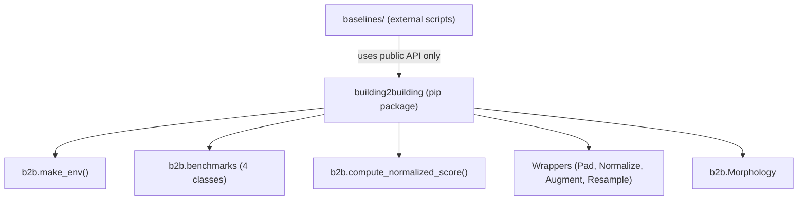

# Building2Building (B2B)

**A large-scale reinforcement learning benchmark for HVAC control.**

---

Reinforcement learning has achieved strong results in control, yet learned
policies remain brittle to changes in dynamics, action spaces, or reward
functions. **Building2Building** (B2B) is a large-scale suite of realistic HVAC
control environments built on EnergyPlus. Starting from ASHRAE 90.1-2022
building prototypes, B2B parametrically generates over **7,000 buildings**
spanning **6 building types**, **16 climate zones**, and **3 distinct HVAC
system types**.

B2B is designed to accelerate research in **transfer learning**, **multi-task
RL**, and **meta-learning** for building energy management.

---

## Feature Highlights

- **7,000+ parametrically generated buildings** across commercial and residential archetypes
- **6 building types**: `SingleFamilyHouse`, `OfficeSmall`, `OfficeMedium`, `RetailStandalone`, `RestaurantFastFood`, `Warehouse`
- **3 HVAC system types**: VAV (Variable Air Volume), Unitary, and Heating-Only
- **4 named task presets** reproducing exact paper conditions
- **4 benchmark problems**: dynamics adaptation, cross-domain generalization, goal adaptation, action-space transfer
- **Morphology graph** for structured per-node observation/action decomposition
- **Normalized scoring** against reactive-controller baselines
- **Gymnasium-compatible** environments with full SB3 integration
- **Hydra + typed dataclass** configuration with CLI override support
- **Pre-processed buildings** downloadable from HuggingFace
- **W&B integration** for experiment tracking
- **SLURM-ready** baseline scripts for cluster training

---

## Quick Start

```python
import building2building as b2b

# Create a Gymnasium environment
env = b2b.make_env("OfficeSmall", split="train", index=0, task="task_const_e0")

obs, info = env.reset()
done = False
while not done:
    action = env.action_space.sample()
    obs, reward, terminated, truncated, info = env.step(action)
    done = terminated or truncated
env.close()
```

### Benchmarks

```python
# Dynamics adaptation: same building type, different instances
bench = b2b.benchmarks.DynamicsAdaptation(difficulty="easy", task="task_const_e0")
train_envs = bench.make_train_envs(n=4)
test_envs = bench.make_test_envs(n=4)
```

### Normalized Scoring

```python
score = b2b.compute_normalized_score(
    cumulative_return=-5000.0,
    building_type="OfficeSmall",
    task="task_const_e0",
    run_period="full_year",
    building_id="OfficeSmall-0001",
)
```

---

## Documentation Overview

| Section | Description |
|---|---|
| [Getting Started](getting-started.md) | End-to-end tutorial from installation to training |
| [User Guide](guide/installation.md) | Environments, buildings, HVAC, rewards, wrappers, configuration |
| [Benchmarks](benchmarks/overview.md) | Four benchmark problems from the paper |
| [Baselines](baselines/overview.md) | Reactive controllers, PPO training, Amorpheus |
| [Tutorials](tutorials/quick-tour.md) | Hands-on examples and runnable scripts |
| [API Reference](api/api.md) | Full module-level API documentation |
| [Known Issues](about/known-issues.md) | Confirmed bugs, limitations, and roadmap |

---

## Architecture



---

## Citing B2B

```bibtex
@article{b2b2025,
  title   = {Building2Building: A Large-Scale Benchmark for Transfer and
             Multi-Task Reinforcement Learning in HVAC Control},
  author  = {TODO},
  journal = {TODO},
  year    = {2025},
}
```
